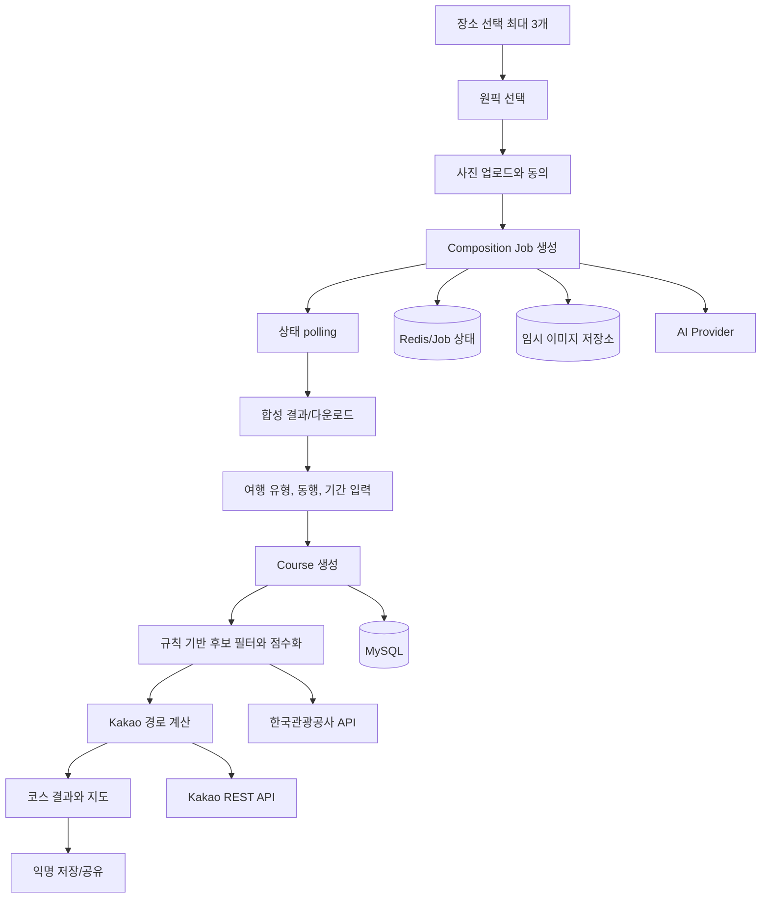

# 미리강릉 프로젝트 구조와 소통/연동 지도

Last Updated: 2026-08-09 14:30 KST
기준: 세 repository의 Markdown 문서, 현재 소스 코드, `PROJECT_STATUS.md` 및 최근 작업 로그

> 이 문서는 2026-08-09 당시 확인한 구조를 보존한 인수인계 스냅샷이다. 이후 변경된 실제 구현 상태는 [`PROJECT_STATUS.md`](PROJECT_STATUS.md)와 각 repository의 최신 코드를 우선한다.

이 문서는 백엔드 참여자가 프로젝트 전체 구조를 빠르게 파악하고 프론트엔드/AI 담당자와 계약을 맞추기 위한 인수인계 문서다. 설계 문서에 적힌 목표와 현재 코드가 다를 수 있으므로, 아래에서 `현재 구현`, `설계 목표`, `통합 전 결정 필요`를 구분한다.

## 1. 한 줄 요약

미리강릉은 사용자가 강릉 관광지를 최대 3개 고르고 그중 하나를 원픽으로 정한 뒤, 사진 합성 Job을 거쳐 관광공사 데이터 기반의 규칙형 여행 코스를 생성하고 Kakao 지도/경로로 보여주는 익명 우선 데스크톱 웹 서비스다.

핵심 백엔드 경계는 다음과 같다.

```text
Frontend
  -> /api/v1 REST/JSON + multipart
Backend Controller
  -> Service
  -> Domain/Repository 또는 외부 Client/Adapter
  -> MySQL/H2, Redis, 임시 이미지 저장소
  -> Tour API, Kakao, AI Provider
```

현재 실제 동작은 이 목표 구조의 일부만 연결되어 있다. Places와 Course의 기본 흐름, 이미지 임시 저장, Kakao route adapter의 뼈대는 백엔드에 있고, AI Provider 실행과 프론트의 실 API 호출은 아직 완성되지 않았다.

## 2. Repository 구성과 역할

세 repository는 같은 서비스의 서로 다른 책임을 나눈 구조다.

| Repository | 기술/역할 | 현재 확인된 책임 |
| --- | --- | --- |
| `MiriGangNeung_BackEnd` | Java 17, Spring Boot 4.0.7, Gradle | REST API, 도메인/영속화, 외부 API adapter, Job/파일 수명주기 |
| `MiriGangNeung_FrontEnd` | React 18, TypeScript, Vite, Zustand, TanStack Query | 6개 화면, 사용자 입력 상태, Kakao Maps UI, 백엔드 API 소비 지점 |
| `MiriGangNeung_Agent` | 역할 문서만 존재 | `README.md`에 에이전트 AI 개발 repository라는 설명만 있고 현재 구현/소통 규칙은 확인되지 않음 |

### Backend repository의 문서 진입 순서

1. [`AGENTS.md`](../AGENTS.md): 작업 규칙과 문서 역할
2. [`docs/CODEX_START_HERE.md`](CODEX_START_HERE.md): clone 직후 진입점
3. [`docs/PROJECT_STATUS.md`](PROJECT_STATUS.md): 현재 코드/검증 결과
4. [`MiriGangNeung_BackEnd_Codex_MD_Set/docs/CODEX_START_HERE.md`](../MiriGangNeung_BackEnd_Codex_MD_Set/docs/CODEX_START_HERE.md): 상세 설계 문서 읽기 순서
5. 작업 영역에 맞는 상세 문서와 [`docs/adr/`](adr/README.md)
6. 실제 코드와 테스트

문서의 역할은 서로 다르다.

- `PROJECT_STATUS.md`는 현재 상태만 기록한다. 계획을 완료된 기능처럼 적지 않는다.
- `WORK_LOG.md`는 과거 작업을 누적한다. 기존 항목을 수정하거나 삭제하지 않는다.
- `docs/adr/`는 중요한 기술/아키텍처 결정의 이유를 기록한다. 현재 별도 ADR 파일은 없다.
- `MiriGangNeung_BackEnd_Codex_MD_Set/docs/`는 API, 데이터, 알고리즘, 외부 연동, 테스트, 배포의 설계 원문이다.
- `api_manual_guide/`의 Markdown은 검색용 변환본이고, 관광공사 endpoint/parameter를 구현할 때는 원본 DOCX를 최종 확인한다.

## 3. 전체 사용자 흐름과 시스템 경계



### 3.1 장소 흐름

설계상 프론트는 장소 카드에 `id`, `name`, `region`, `category/tags`, `thumbnailUrl`, `latitude`, `longitude`를 필요로 한다. 백엔드는 `GET /api/v1/places`와 상세/nearby/related API를 제공하고, 한국관광공사 원문을 내부 `Place`/`PlaceResponse`로 정규화한다.

현재 `PlaceService.search()`는 다음 순서로 동작한다.

1. `TourApiClient.search()`로 강릉 관광지 데이터를 조회한다.
2. 응답을 `Place`로 upsert한다.
3. 저장소에서 페이지를 조회해 `PlacePageResponse`로 변환한다.

현재 코드에는 `RedisCache` helper가 있지만 Place 조회 흐름에 연결된 캐시는 아직 확인되지 않았다. 따라서 `PROJECT_STATUS.md`의 제한사항처럼 관광공사 캐시와 fallback은 목표 구조이지 현재 완성된 흐름으로 보면 안 된다.

### 3.2 Composition 흐름

설계 목표는 다음과 같다.

```text
POST /api/v1/compositions
  -> 즉시 jobId와 QUEUED 반환
  -> AI Provider 요청/상태 polling
  -> ANALYZING -> COMPOSITING -> QUALITY_CHECK -> DONE 또는 FAILED
  -> GET /api/v1/compositions/{jobId}
  -> GET /api/v1/compositions/{jobId}/download
```

현재 코드는 업로드 파일을 `TemporaryImageStorage`에 저장하고 `CompositionJob`을 `QUEUED`로 DB에 저장한다. `AiGenerationClient` 인터페이스는 존재하지만 구현체/실행 worker가 없어, 실제 Provider 호출과 DONE 결과 생성은 아직 없다. 따라서 프론트의 현재 합성 진행 화면을 실제 polling으로 교체하려면 AI 담당자와 아래 계약을 먼저 확정해야 한다.

- `providerJobId`
- Provider 상태와 백엔드 상태의 매핑
- 결과 이미지 reference 형식
- safety status/reason code
- timeout/retry 가능 조건
- `promptVersion`, `modelVersion` 기록 방식

### 3.3 Course 흐름

프론트는 `placeIds`, `onePickId`, `types`, `detailTypes`, `companion`, `duration`을 보낸다. 백엔드는 다음을 검증한다.

- `placeIds`가 비어 있지 않음
- `types`가 최소 1개, 최대 4개
- `detailTypes`가 선택한 여행 타입에 속하는 유효한 값이며 분야별 복수 선택 가능
- `duration=custom`이면 시작일/종료일이 있고 종료일이 시작일보다 빠르지 않음
- `onePickId`가 선택 장소에 포함됨

현재 `RuleBasedCourseRecommendationEngine`은 원픽을 첫 번째 stop으로 넣고, 좌표가 있는 후보를 원픽과의 단순 거리 순으로 정렬해 당일은 최대 3개, `night1`은 최대 4개를 반환한다. 문서에 정의된 preference/crowd/popularity/diversity/time feasibility의 전체 점수 파이프라인은 아직 목표 상태다.

`CourseResponse`의 `totalDistanceMeters`와 `totalTravelMinutes`는 현재 코드에서 0으로 반환된다. Kakao route 결과를 Course 생성에 통합하는 작업은 아직 남아 있다.

### 3.4 익명 저장/공유 흐름

회원/ JWT는 P0 범위가 아니다. Course 생성 후 백엔드는 opaque random token을 만들고 SHA-256 hash만 Course에 저장한다.

```text
POST /api/v1/courses/{courseId}/share
  -> token 원문과 share URL을 응답
  -> DB에는 token hash와 만료시각 저장
GET /api/v1/share/courses/{token}
  -> token hash 조회 및 만료 확인
DELETE /api/v1/courses/{courseId}/share
  -> 공유 철회
```

현재 share token의 기본 만료는 7일이다. Course 삭제/공유 철회/만료 시 public 조회가 더 이상 성공하지 않아야 한다.

### 3.5 지도/도보 경로 흐름

두 경로 구현이 공존하므로 통합 전에 소유권을 정해야 한다.

- 백엔드: `POST /api/v1/routes/walking` -> `RouteService` -> `KakaoRouteClient`
- 프론트: same-origin `GET /api/walking-route?stops=<JSON>` -> Vercel/Vite server handler -> Kakao walking API

현재 프론트의 `CourseMap`은 두 번째 경로를 호출한다. 프론트 server handler는 Kakao REST key를 브라우저에 노출하지 않고 route points만 반환한다. 반면 백엔드 route adapter는 현재 origin/destination 두 점과 거리/시간 응답을 중심으로 구현되어 있고 polyline은 비어 있다.

### 3.6 임시 이미지 수명주기

MVP는 단일 서버의 local temporary storage를 허용한다.

```text
upload -> UUID 기반 input key 저장 -> result key 저장
       -> expiresAt 이후 scheduled cleanup
       -> 파일 삭제 및 Job metadata 정리
```

원본 파일명을 path로 사용하지 않고 UUID 기반 key를 사용한다. 장기 보관/다중 인스턴스/worker 분리가 필요해지면 `TemporaryImageStorage` 구현을 S3-compatible object storage로 교체한다.

## 4. Backend 코드 구조

현재 소스의 주요 패키지와 책임은 다음과 같다.

```text
com.mirigangneung
├── common
│   ├── config       # Redis, CORS, async 등 공통 설정
│   ├── error        # ApiException, 전역 오류 응답
│   └── redis        # RedisCache helper
├── place
│   ├── controller   # /api/v1/places
│   ├── service      # 외부 조회, upsert, DTO 변환 orchestration
│   ├── domain       # Place, PlaceImage
│   ├── repository   # JPA repository
│   └── dto          # 목록/상세 응답
├── composition
│   ├── controller   # multipart 생성, 조회, retry, download
│   ├── service      # 파일 저장과 Job 상태 관리
│   ├── domain       # CompositionJob, CompositionStatus
│   ├── repository
│   └── dto
├── course
│   ├── controller   # Course와 익명 share API
│   ├── service      # 입력 검증, 추천 실행, 저장, token 처리
│   ├── domain       # Course, CourseStop
│   ├── recommendation # CourseRecommendationEngine 추상화/규칙형 구현
│   ├── repository
│   └── dto
├── route
│   ├── controller   # /api/v1/routes/walking
│   ├── service
│   └── dto
├── infrastructure
│   ├── tourapi      # TourApiClient, KoreanTourApiClient
│   ├── kakao        # KakaoRouteClient, REST 구현
│   ├── ai           # AiGenerationClient 계약만 현재 존재
│   └── storage      # TemporaryImageStorage, local 구현
└── MiriGangNeungApplication
```

레이어 규칙은 `Controller -> Service -> Domain/Repository/Client -> DTO mapping -> Response`다.

- Controller는 입력 검증과 HTTP 계약에 집중한다.
- Service는 orchestration과 비즈니스 규칙을 담당한다.
- Repository는 조회/저장에 집중하고 비즈니스 규칙을 넣지 않는다.
- 외부 API는 `TourApiClient`, `KakaoRouteClient`, `AiGenerationClient` 같은 interface 뒤에 둔다.
- Entity를 API response로 직접 반환하지 않는다.
- 외부 API 원문 DTO를 프론트에 직접 노출하지 않는다.

## 5. 현재 Backend API 계약

Base path는 `/api/v1`이다.

| 영역 | Method | Endpoint | 현재 코드의 역할 |
| --- | --- | --- | --- |
| Places | GET | `/api/v1/places` | `category`, `keyword`, `page`, `size`로 검색하고 Page 응답 반환 |
| Places | GET | `/api/v1/places/{placeId}` | DB miss 시 관광공사 상세를 조회해 upsert 후 상세 반환 |
| Places | GET | `/api/v1/places/{placeId}/nearby` | 좌표 기반 주변 후보 조회 |
| Places | GET | `/api/v1/places/{placeId}/related` | 관광공사 연관 후보 조회 |
| Composition | POST | `/api/v1/compositions` | multipart 사진과 `onePickId`를 받아 Job 생성 |
| Composition | GET | `/api/v1/compositions/{jobId}` | Job 상태/진행률/다운로드 가능 여부 반환 |
| Composition | POST | `/api/v1/compositions/{jobId}/retry` | FAILED Job만 재시도 |
| Composition | GET | `/api/v1/compositions/{jobId}/download` | 만료되지 않은 결과 파일 스트리밍 |
| Course | POST | `/api/v1/courses` | 요청 검증, 추천, CourseStop 저장, CourseResponse 반환 |
| Course | GET | `/api/v1/courses/{courseId}` | 저장된 Course 조회 |
| Course | DELETE | `/api/v1/courses/{courseId}` | 익명 Course 삭제 |
| Share | POST | `/api/v1/courses/{courseId}/share` | 7일 만료 opaque token 생성 |
| Share | GET | `/api/v1/share/courses/{token}` | public share 조회 |
| Share | DELETE | `/api/v1/courses/{courseId}/share` | share token 철회 |
| Route | POST | `/api/v1/routes/walking` | origin/destination으로 Kakao route 호출 |

공통 오류 응답은 `timestamp`, `status`, `code`, `message`, `path` 형태다. 대표 code는 `INVALID_REQUEST`, `PLACE_NOT_FOUND`, `COMPOSITION_EXPIRED`, `INVALID_COMPOSITION_STATE`, `TOUR_API_ERROR`, `KAKAO_API_ERROR`, `IMAGE_TOO_LARGE`, `UNSUPPORTED_IMAGE`, `INTERNAL_ERROR`다.

## 6. Frontend 구조와 현재 백엔드 연결 상태

### 6.1 Frontend 화면/상태 구조

`App.tsx`는 다음 6개 route를 `PageLayout` 아래에 둔다.

```text
/                  BackgroundPickerPage
/one-pick          OnePickConfirmPage
/photo-upload      PhotoUploadPage
/composite-result  CompositeResultPage
/course-options    CourseOptionsPage
/course-result     CourseResultPage
```

- Zustand: `picks`, `onePick`, `types`, `detailTypes`, `companion`, `duration`, `startDate`, `endDate`
- 페이지 local state: 동의 checkbox, 합성 진행 UI, 활성 stop, 장소 추가 패널
- TanStack Query: `usePlacesQuery`, `useCourseStopsQuery` 경계는 만들어져 있으나 현재 `Promise.resolve(정적 데이터)`를 반환한다.
- Kakao Maps: `CourseMap`이 SDK, marker, 선택 동기화, 도보 route overlay를 담당한다.

### 6.2 현재 연결되지 않은 Mock 지점

| 프론트 지점 | 현재 상태 | 실제 연동 시 교체할 것 |
| --- | --- | --- |
| `usePlacesQuery` | `PLACES` 정적 배열 | `GET /api/v1/places` fetch와 응답 mapping |
| `useComposeRun`/`PhotoUploadPage` | timer/stage mock | multipart Composition 생성과 status polling |
| `CompositeResultPage` | 결과 URL을 백엔드에서 받지 않음 | Job result/download URL 소비 |
| `useCourseStopsQuery` | `COURSE_STOPS` 정적 배열 | Course 생성 요청과 `CourseResponse.stops` mapping |
| `CourseResult` 장소 추가 | 현재 세션 local state만 변경 | 저장/재산정 API가 필요할 때 별도 계약 추가 |
| `CourseMap` 도보 경로 | 프론트 `/api/walking-route` server handler 사용 | 백엔드 route API로 통일하거나 현재 proxy를 공식 경계로 결정 |

### 6.3 현재 계약 불일치

현재 프론트 문서/타입은 백엔드 최종 계약과 일부 다르다. 이것은 단순한 이름 차이로 넘기지 말고 연동 작업의 첫 번째 체크리스트로 삼는다.

| 항목 | Backend 계약/현재 응답 | Frontend 초안/현재 타입 | 통합 시 할 일 |
| --- | --- | --- | --- |
| 장소 목록 | `GET /api/v1/places`, `content/page/size/totalElements/totalPages` | `GET /api/places`, `{ places: Place[] }` | base path와 page response mapping 확정 |
| Composition 생성 | multipart `photo`, `onePickId`, optional `aspectRatio`; `{ jobId, status: "QUEUED" }` | `/api/composite-jobs`; `{ id, status: "queued" }` | endpoint, ID field, status enum을 backend 계약에 맞춤 |
| Composition 완료 | `downloadUrl`, `resultAvailable`, `place`, `error` | `resultUrl` 중심 | 다운로드 권한/TTL/결과 shape 확정 |
| Course 응답 | `courseId`, `title`, `duration`, `stops`, distance/time | `{ stops: CourseStop[] }` 초안 | backend stop field를 frontend domain으로 변환 |
| Route | `POST /api/v1/routes/walking`, 두 좌표 request | `GET /api/walking-route?stops=<JSON>`, 여러 stop geometry | route ownership과 다중 stop contract 결정 |
| 상태 enum | Backend 대문자 `QUEUED`, `ANALYZING` 등 | Frontend 소문자 `queued`, `running`, `done` | 한쪽에서 mapping하고 공통 타입을 정함 |

프론트의 `docs/api-spec-draft.md`는 이름 그대로 초안이다. 실제 연동 시 백엔드 [`06_API_SPECIFICATION.md`](../MiriGangNeung_BackEnd_Codex_MD_Set/docs/06_API_SPECIFICATION.md)와 프론트 타입을 동시에 수정하고, 예시 JSON만 맞춘 뒤 실제 fetch/통합 테스트를 생략하지 않는다.

## 7. 데이터와 외부 시스템 소유권

| 데이터/시스템 | Source of truth | Backend 책임 | Frontend/다른 담당자 책임 |
| --- | --- | --- | --- |
| 관광지 사실/좌표/사진 | 한국관광공사 API + 백엔드 정규화 DB | API key 보관, 호출, normalize, `Place` 저장/응답 | 백엔드 API만 호출하고 raw response를 가정하지 않음 |
| Course 영속 데이터 | MySQL/JPA | Course/CourseStop 저장, 삭제, share token hash | response를 화면 model로 mapping |
| Cache/단기 상태 | Redis | 관광공사 cache, Job 상태, TTL data. 영속 데이터 대체 금지 | Redis를 직접 호출하지 않음 |
| 입력/결과 이미지 | 임시 파일 저장소 | UUID key, TTL, 다운로드, cleanup | 원본 path를 직접 만들거나 장기 저장하지 않음 |
| 이미지 합성 | AI Provider | `AiGenerationClient` 계약, 상태/안전성/재시도 | Job polling과 사용자 상태 표시 |
| 지도 표시 | Kakao Maps JS SDK | 프론트에 필요한 좌표/정규화 결과 제공 | marker/polyline/선택 상태 UI |
| 경로 계산 | Kakao REST API | 백엔드 또는 server proxy 중 하나의 공식 owner | 선택된 경로를 지도에 표시 |

외부 API의 key, timeout, retry, TTL, 추천 weight는 환경변수/설정으로 관리한다. secret은 코드, 문서, commit에 넣지 않는다.

## 8. 소통 구조와 작업 프로토콜

Repository에 Slack/Discord/이슈 트래커의 채널명이나 담당자 목록은 기록되어 있지 않다. 따라서 아래는 현재 문서로 확인되는 소통 구조와, 실제 협업 때 지켜야 할 최소 handoff 규칙을 분리한 것이다.

### 8.1 현재 확인되는 역할 경계

| 역할 | 주로 결정/소통해야 하는 것 | 백엔드가 받아야 하는 결과 |
| --- | --- | --- |
| Frontend | 화면 입력, loading/error/empty state, 실제 소비할 response shape, 지도 상호작용 | API endpoint/method, request field, response field, 상태 enum, 오류 처리 |
| Backend | `/api/v1` 계약, validation, domain/DB, 외부 API adapter, 보안/TTL | 프론트가 호출 가능한 안정된 contract와 smoke 결과 |
| AI 담당 | Provider/model, 생성/상태/safety 계약, 비용/timeout | `AiGenerationClient`로 매핑 가능한 provider contract |
| Agent/문서 담당 | 작업 범위와 인수인계 문서 | 결정사항, 변경 파일, 검증 결과, 남은 blocker |

AI Provider와 같은 미정 영역은 백엔드가 임의로 업체나 모델을 정하지 않는다. 중요한 API 계약/외부 API/데이터 모델 변경도 결정권자 확인 없이 확정하지 않는다.

### 8.2 작업 요청을 받을 때 확인할 항목

요청을 받으면 아래 6가지를 먼저 문장으로 맞춘다.

1. 어떤 사용자 흐름인가: 장소, 합성, 코스, 경로, 공유 중 무엇인가?
2. P0 범위인가, P1/P2 확장인가?
3. API 계약이 바뀌는가: path, method, request, response, status code, error code?
4. 데이터/외부 연동이 바뀌는가: MySQL, Redis, Tour API, Kakao, AI, storage?
5. 현재 프론트 Mock/타입을 실제 호출로 바꾸는 작업인가?
6. 완료를 무엇으로 검증할 것인가: unit, controller, integration, Docker smoke, browser flow?

### 8.3 백엔드 작업 순서

```text
요청/결정 확인
  -> AGENTS.md + PROJECT_STATUS.md
  -> 관련 상세 문서/ADR
  -> 현재 코드와 테스트
  -> 계약/영향 범위 기록
  -> 구현
  -> 테스트/실행 검증
  -> PROJECT_STATUS.md 갱신
  -> WORK_LOG.md에 handoff 기록
```

의미 있는 작업의 `WORK_LOG` 항목에는 날짜, 시작/완료 시각(KST), agent, 작업 내용, 주요 파일, 테스트 결과, 문제/해결, 관련 commit을 남긴다. 정확한 과거 시각을 모르면 임의로 만들지 않고 `시간 미기록`으로 쓴다.

### 8.4 API 계약 변경 handoff

API를 바꾸는 경우 다음 순서를 사용한다.

1. 백엔드 `06_API_SPECIFICATION.md`에 변경 전/후를 기록한다.
2. 프론트 `src/types/api.ts`, query 함수, 화면 mapping의 영향 파일을 함께 찾는다.
3. 상태 enum과 오류 응답을 양쪽에서 같은 표로 확인한다.
4. 백엔드 controller/service 테스트와 프론트 query/mapper 테스트를 추가한다.
5. 실제 요청 1회 이상을 smoke test하고, 문서의 예시가 실제 response와 같은지 확인한다.
6. 계약이 깨지는 변경이면 `/api/v2` 또는 명시적 migration 계획을 결정한다.

### 8.5 작업 완료 메시지/인수인계 템플릿

```text
[영역] Places | Composition | Course | Route | Share | Infra
[목표] 사용자가 무엇을 할 수 있게 되었는가
[계약] method/path, request, response, status/error 변경
[변경 파일] backend / frontend / docs
[외부 연동] Tour/Kakao/AI/Redis/Storage 영향
[검증] 명령과 결과, 미실행이면 원인
[남은 문제] 현재 blocker, 결정이 필요한 항목
[다음 담당자] 다음 작업과 먼저 읽을 문서
```

“구현 완료”라고만 전달하지 말고, 특히 실제 Provider 미연결, API key 미등록, Docker/브라우저 검증 여부를 분리해서 적는다.

## 9. 현재 상태와 우선 통합 순서

### 현재 코드에서 확인된 상태

- Backend `./gradlew.bat test` 기준 단위 테스트 2개가 통과한 상태가 문서에 기록되어 있다.
- Docker health와 `GET /api/v1/places`의 강릉 관광지 smoke 결과가 기록되어 있다.
- Backend에는 P0 controller 경로의 뼈대가 있다.
- AI Provider 구현체, 비동기 polling, Controller integration test, MySQL/Redis integration test는 아직 없다.
- Redis helper는 있지만 Place cache 흐름에 연결되지 않았다.
- Course route 거리/시간은 현재 0이고, 추천은 단순 좌표 거리 기반이다.
- Frontend의 장소/합성/코스는 현재 Mock이고, Course place addition은 세션 local state만 수정한다.
- Frontend 도보 경로는 Backend route controller가 아니라 별도 server handler를 호출한다.

### 추천 통합 순서

1. **계약 하나 정하기:** `/api/v1`를 공통 base로 삼을지, 프론트 serverless proxy를 둘지 결정하고 endpoint/response/status 표를 확정한다.
2. **Places 연결:** `usePlacesQuery`를 실제 API로 교체하고 `content`와 프론트 `Place`를 mapping한다. 사진/설명/좌표 null 정책도 정한다.
3. **Composition 연결:** AI 담당자로부터 provider contract를 받아 `AiGenerationClient` 구현, Job 상태 polling, result/download/expired/error 흐름을 end-to-end로 검증한다.
4. **Course 연결:** 프론트 조건을 `CreateCourseRequest`로 보내고, `CourseResponse.stops`의 field/enum을 화면 model에 mapping한다.
5. **Route ownership 결정:** Backend `POST /api/v1/routes/walking`로 통일할지, 현재 프론트 proxy를 유지할지 결정한다. 다중 stop과 polyline이 필요한 경우 명시한다.
6. **운영 hardening:** Redis cache/status, rate limit, cleanup scheduling, CORS production origin, metrics, integration test를 보완한다.

## 10. 실행과 검증 메모

### Backend

```bash
./gradlew bootRun
./gradlew test
docker compose up --build
```

기본은 H2 memory DB와 localhost Redis다. MySQL/Redis/Tour/Kakao/AI 설정은 `.env` 또는 환경변수로 주입하며 실제 key는 `.env`에만 둔다. health 확인 endpoint는 `GET http://localhost:8080/actuator/health`다.

### Frontend

```bash
npm install
npm run dev
npm run test -- --run
npm run lint
npm run build
```

브라우저용 Kakao Maps key와 server-only Kakao REST key는 분리한다. REST key를 `VITE_*` 변수로 번들에 노출하지 않는다.

### 검증 시 공통 체크

- API key/secret이 diff, 로그, 문서 예시에 들어가지 않았는가?
- Entity/raw external DTO가 프론트 response로 바로 새지 않는가?
- 오류가 HTTP status와 `code`로 정규화되는가?
- 이미지 파일과 임시 key에 TTL이 적용되는가?
- Redis 장애가 MySQL 영속 데이터 손상으로 이어지지 않는가?
- 프론트 Mock이 남아 있는데 실제 연동 완료로 보고하지 않았는가?
- 문서의 “현재 상태”와 실제 코드/테스트 결과가 일치하는가?

## 11. 근거 문서 색인

### Backend

- [`AGENTS.md`](../AGENTS.md)
- [`README.md`](../README.md)
- [`PROJECT_STATUS.md`](PROJECT_STATUS.md)
- [`WORK_LOG.md`](WORK_LOG.md)
- [`Backend detailed start`](../MiriGangNeung_BackEnd_Codex_MD_Set/docs/CODEX_START_HERE.md)
- [`Frontend contract`](../MiriGangNeung_BackEnd_Codex_MD_Set/docs/02_FRONTEND_CONTRACT.md)
- [`Backend architecture`](../MiriGangNeung_BackEnd_Codex_MD_Set/docs/05_BACKEND_ARCHITECTURE.md)
- [`API specification`](../MiriGangNeung_BackEnd_Codex_MD_Set/docs/06_API_SPECIFICATION.md)
- [`Data model`](../MiriGangNeung_BackEnd_Codex_MD_Set/docs/07_DATA_MODEL.md)
- [`AI integration`](../MiriGangNeung_BackEnd_Codex_MD_Set/docs/09_AI_INTEGRATION.md)
- [`External APIs`](../MiriGangNeung_BackEnd_Codex_MD_Set/docs/11_EXTERNAL_APIS.md)
- [`Test strategy`](../MiriGangNeung_BackEnd_Codex_MD_Set/docs/14_TEST_STRATEGY.md)
- [`Decision log`](../MiriGangNeung_BackEnd_Codex_MD_Set/docs/17_DECISION_LOG.md)
- [`Deployment`](../MiriGangNeung_BackEnd_Codex_MD_Set/docs/20_DEPLOYMENT.md)
- [`Glossary`](../MiriGangNeung_BackEnd_Codex_MD_Set/docs/21_GLOSSARY.md)

### Frontend

- [`Frontend README`](../../MiriGangNeung_FrontEnd/README.md)
- [`Frontend API draft`](../../MiriGangNeung_FrontEnd/docs/api-spec-draft.md)
- [`Frontend data requirements`](../../MiriGangNeung_FrontEnd/docs/data-requirements.md)
- [`Frontend state flow`](../../MiriGangNeung_FrontEnd/docs/state-flow.md)
- [`Kakao walking route design`](../../MiriGangNeung_FrontEnd/docs/superpowers/specs/2026-08-07-kakao-walking-route-design.md)

### Agent

- [`Agent README`](../../MiriGangNeung_Agent/README.md)

## 12. 문서 갱신 규칙

이 문서는 전체 구조와 cross-repository handoff를 설명한다. 기능별 세부 계약을 이 파일에 복사하지 않는다.

- API field/path 변경 -> `06_API_SPECIFICATION.md`와 이 문서의 불일치 표를 함께 갱신
- 현재 구현/검증 변경 -> `PROJECT_STATUS.md` 갱신
- 작업 완료 기록 -> `WORK_LOG.md` append
- 중요한 설계 결정 -> `docs/adr/`에 새 ADR 추가
- AI Provider/외부 API endpoint 변경 -> 담당자 결정과 공식 원문 근거를 함께 기록

이 문서를 읽은 다음 실제 작업을 시작할 때는 `PROJECT_STATUS.md`를 다시 읽고, 설계 문서와 코드가 충돌하는지 먼저 확인한다.
